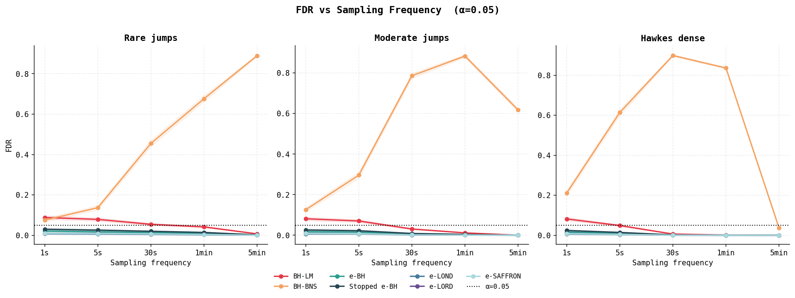

# efdr-jumps

E-value based online FDR control for jump detection in high-frequency financial semimartingales.

M1 MAEF research project — Neyl Gasmi & Jules Brion. Supervisor: Alain Celisse (SAMM, Université Paris 1), 2025–2026. Full derivation and proofs: [`paper/publish.pdf`](paper/publish.pdf).

## Result

Benjamini-Hochberg applied to classical jump tests does not control the false discovery rate across this Monte Carlo grid (5 sampling frequencies from 1s to 5min, 3 jump-intensity regimes, 2 jump sizes, α ∈ {0.05, 0.10}, 500 replications per cell). BH on the Barndorff-Nielsen-Shephard ratio test reaches FDR = 0.503 pooled, against a 0.05 target. BH on the Lee-Mykland statistic stays under target on aggregate but crosses above it at 1s–5s sampling in the low- and moderate-intensity regimes. Both baselines localize volatility with an untrimmed, fixed-window bipower variation that nearby true jumps contaminate, worse at high sampling frequency, where more jumps fall inside a fixed 100-tick window. e-value procedures (e-BH, e-LOND, e-LORD, e-SAFFRON, Stopped e-BH) hold FDR ≤ 0.013 over the same grid; their guarantee does not depend on the plugged-in volatility estimate being correctly calibrated.

| Algorithm | FDR | Power | F1 |
|---|---|---|---|
| e-LOND | 0.003 | 0.161 | 0.342 |
| e-LORD | 0.004 | 0.145 | 0.322 |
| e-SAFFRON | 0.004 | 0.143 | 0.320 |
| e-BH | 0.009 | 0.231 | 0.405 |
| Stopped e-BH | 0.013 | 0.242 | 0.415 |
| BH-LM | 0.040 | 0.335 | 0.490 |
| BH-BNS | 0.503 | 0.638 | 0.362 |

α = 0.05, pooled over the full `grid_main` sweep. Source: [`results/figures/fig4_heatmap_alpha5.png`](results/figures/fig4_heatmap_alpha5.png).

## FDR vs. sampling frequency



## Where classical detection breaks

BH-LM is the highest-power procedure outside BH-BNS at every sampling frequency and in every regime ([`fig2_power_vs_freq_alpha5.png`](results/figures/fig2_power_vs_freq_alpha5.png)), which puts it on the FDR–power frontier alongside the e-value procedures ([`fig3_tradeoff_alpha5.png`](results/figures/fig3_tradeoff_alpha5.png)) rather than off it like BH-BNS. It stays inside the α = 0.05 band at 30s and coarser, in all three regimes. It breaches the band at 1s in every regime, and still at 5s in the rare and moderate regimes: the corner where jumps are infrequent enough, and ticks numerous enough, for the causal 100-tick bipower-variation window to routinely contain another true jump before the estimator has averaged it out.

BH-BNS is never on the frontier. It is a day-level test (`bh_bns_global` in `fdr/baselines.py`): one global verdict, stamped onto every tick in the path (`[detected] * len(r)` in `pipeline/detector.py`). It cannot trade precision against recall within a path, so its FDR and power move together instead of trading off. Both rise with jump size ([`fig5_jump_size_alpha5.png`](results/figures/fig5_jump_size_alpha5.png)), and, in the moderate and hawkes-dense regimes, both trace the same inverted-U shape across frequency, peaking in the 30s–1min band and collapsing by 5min.

## Method

**Price process.** Heston (1993) stochastic-volatility diffusion with a Merton (1976) compound-Poisson log-normal jump overlay, in the Andersen-Benzoni-Lund (2002) parameterization: d log S = (μ − V/2 − λk̄) dt + √V dW_S + J dN, dV = κ(θ − V) dt + ξ√V dW_V, corr(dW_S, dW_V) = ρ. Defaults: κ=2.0, θ=0.04 (σ≈20% annualized), ξ=0.5, ρ=−0.7, v₀=0.04 (`pipeline/detector.py::SimulatorConfig`). Jump mean μ_J = jump_size_sigma·σ·√dt with jump_size_sigma ∈ {3, 5}; jump std σ_J = 0.1·|μ_J|.

Three jump-intensity regimes share this one process: rare (λ=1500/yr), moderate (5000/yr), hawkes_dense (15000/yr). `hawkes_dense` currently reuses the same constant-rate Poisson mechanism as the other two: `simulate/hawkes.py` implements a genuine self-exciting process, but `pipeline/detector.py` never imports it, so no run in this grid tests dependence induced by jump clustering. `simulate/noise.py` similarly defines additive and one-sided microstructure-noise models that are not wired into the detector; the simulated paths are noise-free efficient prices.

**e-values.** For each return r_i, a causal, jump-robust spot-variance estimate σ̂²_i (bipower variation, MedRV, MinRV, or threshold-truncated RV, in `estimators/`) is computed on a 100-tick trailing window that excludes r_i itself. The e-value is the closed-form GROW e-value for a Gaussian-mixture N(0, τ²) alternative on the jump size (`evalues/construct.py`):

E_i = √(Δσ̂² / (Δσ̂² + τ²)) · exp( r_i²τ² / (2Δσ̂²(Δσ̂² + τ²)) ), τ = 5·σ̂_i·√dt

**FDR procedures.**

| Procedure | Type | Dependence guarantee | Reference |
|---|---|---|---|
| e-BH | Offline | Arbitrary | Wang & Ramdas 2022 |
| e-LOND | Online | Arbitrary | Xu & Ramdas 2024 |
| e-LORD | Online | Arbitrary | Zhang et al. 2025 |
| e-SAFFRON | Online | Arbitrary | Zhang et al. 2025 |
| Stopped e-BH | Online (anytime) | Causal exclusion | Wang, Dandapanthula & Ramdas 2025 |
| BH-LM | Offline | PRDS | Lee & Mykland 2008 |
| BH-BNS | Offline, day-level | PRDS | Bajgrowicz, Scaillet & Treccani 2016 |

e-BH sorts e-values descending and rejects the largest k with E_(k) ≥ n/(αk). e-LOND sets α_t = α·γ_t·(R_{t-1}+1) and rejects iff E_t ≥ 1/α_t, with γ_t a Javanmard-Montanari sequence normalized to Σγ_t = 1 (`fdr/elond.py`). e-LORD and e-SAFFRON reallocate wealth dynamically under the e-GAI/RAI framework, with initial wealth fraction w1 ∈ {0.0005, 0.0025, 0.005, 0.05}. BH-LM and BH-BNS feed two-sided normal p-values from the same untrimmed, causal bipower-variation window into Benjamini & Hochberg (1995); BH-BNS's p-value comes from a single ratio test on the full path rather than a per-tick statistic.

**Grid.** `experiments/configs/grid_main.yaml`: frequencies {1, 5, 30, 60, 300}s, regimes {rare, moderate, hawkes_dense}, jump sizes {3σ, 5σ}, α ∈ {0.05, 0.10}, 4 spot-variance estimators, 7 algorithms, 500 replications per cell, giving 1,560,000 task configurations (`experiments/02_power_grid.py::_expand_grid`), run in parallel with joblib. The config does not set `n_steps`; it defaults to 500 ticks per simulated path.

**Metrics.** FDP = |R \ J| / |R| (0 if R is empty). Power and F1 use a ±2-tick localization tolerance around each true jump index (`pipeline/metrics.py`).

## Reproduce

```bash
pip install -e .
pytest tests/                                                  # 86 tests

# fast sanity check (~100k tasks, a few minutes)
python experiments/02_power_grid.py --config experiments/configs/grid_medium.yaml

# full sweep behind the figures above (~1.56M tasks, joblib-parallel)
python experiments/02_power_grid.py \
  --config experiments/configs/grid_main.yaml \
  --output results/grid_main.parquet --n-jobs -1

python notebooks/03_results_figures.py \
  --input results/grid_main.parquet --output results/figures
```

Requires Python ≥ 3.9.

## References

- Benjamini, Y. & Hochberg, Y. (1995). Controlling the False Discovery Rate. *JRSS-B* 57(1):289–300.
- Lee, S. & Mykland, P. (2008). Jumps in Financial Markets. *Review of Financial Studies* 21(6):2535–2563. https://doi.org/10.1093/rfs/hhm056
- Barndorff-Nielsen, O. & Shephard, N. (2004). Power and Bipower Variation with Stochastic Volatility and Jumps. *Journal of Financial Econometrics* 2(1):1–37. https://doi.org/10.1093/jjfinec/nbh001
- Bajgrowicz, P., Scaillet, O. & Treccani, A. (2016). Jumps in High-Frequency Data: Spurious Detections, Dynamics, and News. *Management Science* 62(8):2198–2217. https://doi.org/10.1287/mnsc.2015.2234
- Andersen, T., Benzoni, L. & Lund, J. (2002). An Empirical Investigation of Continuous-Time Equity Return Models. *Journal of Finance* 57(3):1239–1284.
- Vovk, V. & Wang, R. (2021). E-values: Calibration, Combination and Applications. *Annals of Statistics* 49(3):1736–1754. https://arxiv.org/abs/1912.06116
- Wang, R. & Ramdas, A. (2022). False Discovery Rate Control with E-values. *JRSS-B* 84(3):822–852. https://arxiv.org/abs/2009.02824
- Xu, Z. & Ramdas, A. (2024). Online Multiple Testing with e-values. *AISTATS 2024*. https://arxiv.org/abs/2311.06412
- Zhang, Y., Wei, Z., Ren, H. & Zou, C. (2025). e-GAI: e-value-based Generalized α-Investing for Online FDR Control. https://arxiv.org/abs/2506.01452
- Wang, H., Dandapanthula, S. & Ramdas, A. (2025). Anytime-valid FDR Control with the Stopped e-BH Procedure. https://arxiv.org/abs/2502.08539
